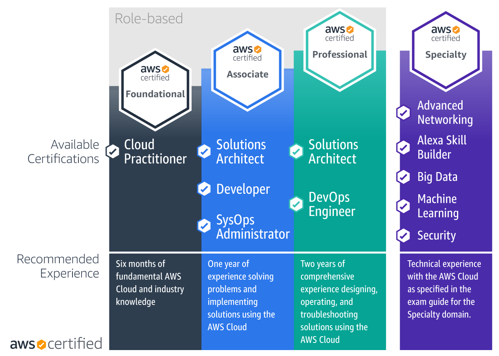

```toc
``` 
# AWS Certification Overview

You can learn more about the different AWS certifications below: 


Image source: https://d1.awsstatic.com/training-and-certification/certification-roadmaps/Cert-Roadmap-v10.2.e6794a76d8f03b3840e69dddcde11d1749903906.png

Note: The years of experience associated are just for example. It’s not a strict pre-requisite to write the exam.


## Scope and depth for certificates

| **Certification Type** | **Scope** | **Depth** |
|:---:|:---:|:---:|
| Foundational | Broad | Shallow |
| Associate | Broad | Medium |
| Professional | Broad | Deep |
| Specialty | Narrow | Deep |

# Learning Paths

There are two main ways in which you can choose your learning path:

•	Role-based learning path

•	Skills-based learning path

## Role-based learning path

If you’re targeting for particular roles such as the ones given below: 

•	Architect

•	Developer

•	SysOps Engineer

•	DevOps Engineer

## Skills-based learning path

If you’re targeting to learn specific set of skills such as ones given below:

•	Machine Learning

•	Data Analytics

•	Advanced Networking

•	Security

•	Database

•	SAP

# Frequently Asked Questions 

## Pre-requisities to take AWS certifications

All certifications are independent of each other. You take take any of them directly. However, going with incremental improvements (foundational knowledge to advanced knowledge) is recommended.

## Which AWS certification should I get first? 

* If you are totally new to the AWS cloud, get started with the AWS Certified Cloud Practitioner. 
  
  This gives you a broad introduction to the key AWS services and helps you understand how the AWS Cloud works.

* If you already have some experience with AWS, a great stepping stone towards the next level certification can be the AWS Solutions Architect Associate. 
  
  This gives a high-level overview and medium understanding of creating solutions architecting on AWS for various business needs.

* For more details, please check AWS Certification [FAQ](https://aws.amazon.com/certification/faqs/?ch=sec&sec=faq). 

* Please check exam guides for specific certifications.

## How to study and prepare?

Essential elements of trainings: 

•	Understanding of theory concepts

•	Practicing the exam questions

•	Recommended to do hands-on practical experience

### Options

1. AWS Trainings

2. YouTube videos

3. Dedicated course on Udemy/other online platforms

* Although one may tend to go for free options such as on AWS website, or YouTube videos to learn theory concepts. However, the most efficient way is to do it through a dedicated course, which is usually paid. For example, [NEW Ultimate AWS Certified Cloud Practitioner - 2022](https://www.udemy.com/course/aws-certified-cloud-practitioner-new/), or the ones from [Digital Cloud](https://digitalcloud.training/) as mentioned below. These options are really worth the money you pay for.

* Irrespective of whether you buy a paid course to learn theory concepts or you learn them for free, buying "practice exams" course is really heavily recommended and the most efficient way to crack the certificate.

# My AWS Certifications Journey

## AWS Cloud Practitioner (AWS CCP)

I started with AWS Cloud Practitioner certificate first. I prepared on my own through 
https://digitalcloud.training/aws-certified-cloud-practitioner/ ultimate training package, and wrote the exam.

### Steps of learning
•	**Theory**: Understanding theory concepts by watching video tutorial course
	*  Alternatively, you can watch the full video on YouTube for free: 
	[AWS Certified Cloud Practitioner Certification Course ](https://www.youtube.com/watch?v=SOTamWNgDKc) 

•	**Practice**: Practicing exam questions by doing practice exam course

•	**Hands-on**: I was already working on AWS in my previous project, so did not do hands-on separately.

**Time spent** about two weeks for understanding concepts, two weeks for practicing exam questions.

**Certification passed**: 13 Dec 2021

## AWS Solutions Architect (AWS SAA)

Next, I continued with AWS Solutions Architect Associate certificate. I prepared through 
https://digitalcloud.training/aws-certified-solutions-architect-associate/ ultimate training package, and wrote the exam.

### Steps of learning
•	**Theory**: Understanding theory concepts by watching video tutorial course

•	**Practice**: Practicing exam questions by doing practice exam course

•	**Hands-on**: I tried working with some but not all hands-on lessons in the course


**Time spent**: about six weeks for understanding concepts, two weeks for  practicing exam questions. 

**Certification passed**: 7 Dec 2022


## Reasons to do it this way

•	**Self-paced course**: The sessions can be spread over time which is good when learning a new thing. 

•	**Efficient**: It offers 500+ practice questions to practice for a confident preparation.

•	**Hands-On**: Opportunity to do practical hands-on exercises as well.

## Helpful resources

* https://towardsaws.com/aws-solution-architect-associate-certification-study-notes-c32f50503f8a

* https://www.kaustubhsharma.com/blog/AWS-SOLUTIONS-ARCHITECT-ASSOCIATE-cheat-sheet

### Revision: using Mind maps

I used mind-maps to quickly revise various services.
  
* Do a quick search for "aws cloud practitioner mind map" or "aws solutions architect associate mind map". Look for images.

* Disclaimer: I have no conflict of interest while mentioning resources for any monetary benefits.