<!-- ---
title: "Portfolio item number 1"
excerpt: "Short description of portfolio item number 1 "
collection: portfolio
--- -->

<!-- This is an item in your portfolio. It can be have images or nice text. If you name the file .md, it will be parsed as markdown. If you name the file .html, it will be parsed as HTML.  -->

# Data-driven Projects

## NeuroAI: brain-tumor-classification (Deep Learning: Computer Vision)

* This is an end-to-end machine learning lifecycle project, when I started from picking the dataset up to deploying as a web application. This helped me learn various nuance of a ML project development. 

* We follow ML workflow as depicted in the figure below

Machine Learning Workflow

Image Credits: Strata London - Deep Learning, Turi, Inc. [link](http://www.slideshare.net/turi-inc/strata-london-deep-learning-052015)

* After the ML Model is created, we use transfer learning, with workflow as shown below:

Transfer Learning Workflow

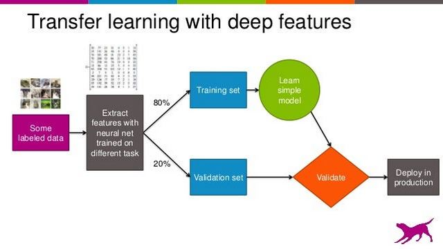

Image Credits: big-data-and-business-intelligence, Packtpub [link](https://subscription.packtpub.com/book/big_data_and_business_intelligence/9781788831307/1/ch01lvl1sec13/standard-ml-workflow)

* This is a project, making computers to learn to predict, if an image contains traces of tumor. 

* **Skills:** Python, Tensorflow, Keras, Numpy, Pandas, Streamlit, Heroku

* Sounds interesting, want to try out yourself? Simply use any webpage and upload image.

This is the screenshot from deployed web application:
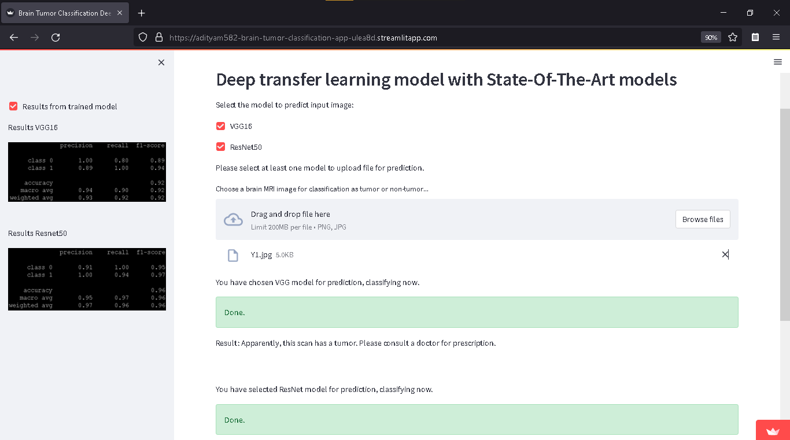

* Click here to use application deployed on [Streamlit](https://adityam582-brain-tumor-classification-app-ulea8d.streamlitapp.com/)

* Click here to use application deployed on [Heroku](https://neuroai-image-classifier.herokuapp.com/)

<!-- 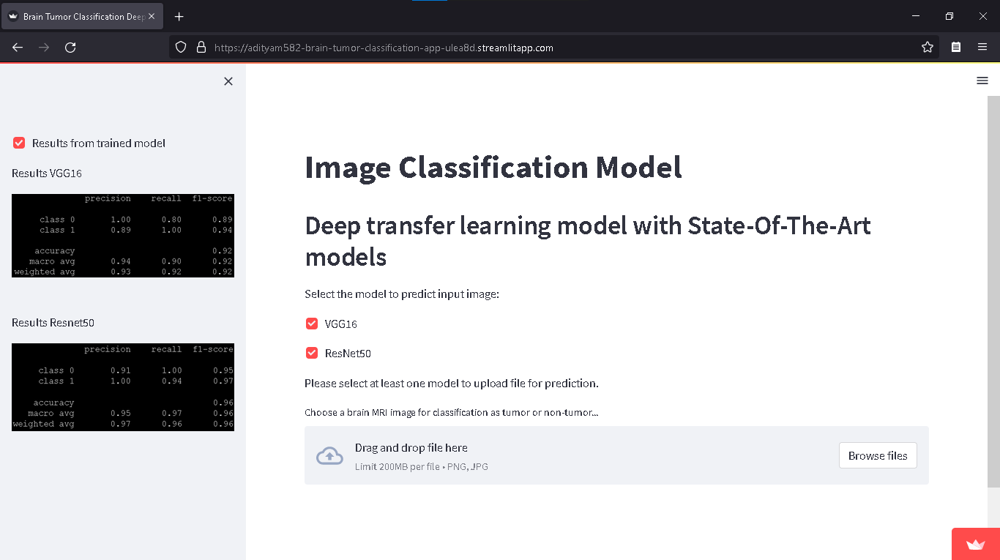

 -->
<!-- 
 -->

## New York City Taxi Trip Data Analysis (Big Data: Data Analysis)

* **Purpose:** to analyse traffic patterns and insights from New York City's taxi data. 

* **Methodology**: exploratory data analysis and created machine learning algorithm for prediction of fare amounts based on different features 

* **Use cases:** Traffic Optimization and Financial Analysis

**Technologies/Tools:** Spark on a distributed cluster with 4 servers, PySpark, SQL API, Pandas, Matplotlib, Seaborn 

* Please check the complete report: [click here](https://adityam582.github.io/files/BigDataProjectReport.pdf)

* **Results**

Daily trips

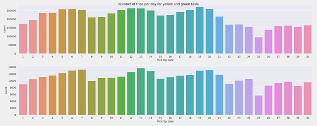

Average distance per ride for weekday trips

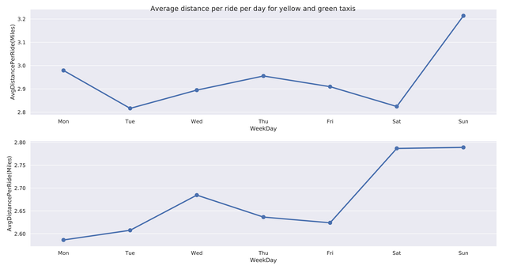

## Sensors Data Analytics (IoT: Data Analytics)

* The purpose of this project is to analyze real-world IoT sensors dataset, to identify seasonal activity patterns, and create visualization such as a dashboard.

**Technologies/Tools:** Python, Matplotlib, Seaborn, 

* Visualization: [Click to see animated visualization](https://drive.google.com/file/d/1gDaSUJgnSAhwLtndxnUqVwOxO3edKH9t/view)

* Please check the complete report: [click here](https://adityam582.github.io/files/IOTExercise2.pdf)

* **Results**

IoT Sensor locations on map of Tellus - Uni Oulu

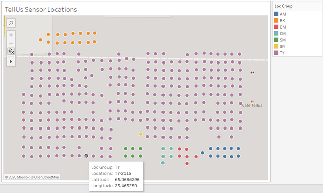

Motion Activity - Areas

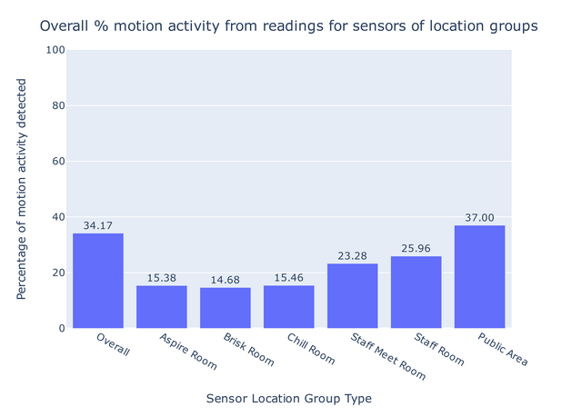

Motion activity throughout year

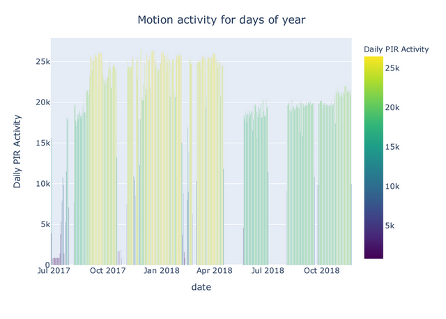

## Indian Elections Analysis (Computational Social Science: Data Analysis)

* **Purpose**: to analyze women participation in Indian national elections over period 1977-2014.

* **Results**

Representation of women in Indian elections

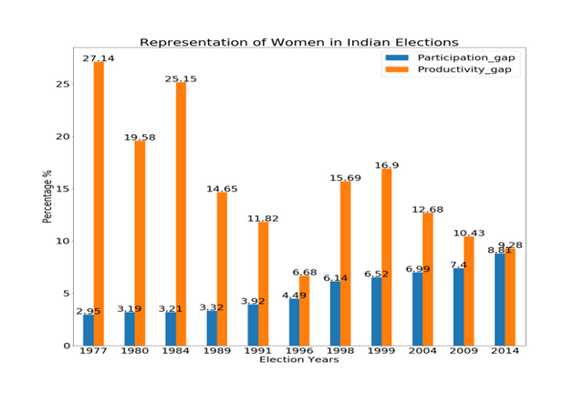

Winning women representation from political parties

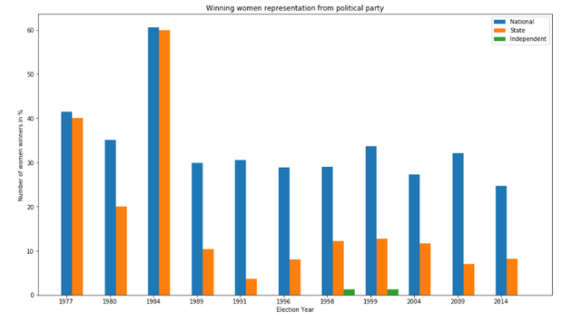

Vote share and Year-on-Year growth

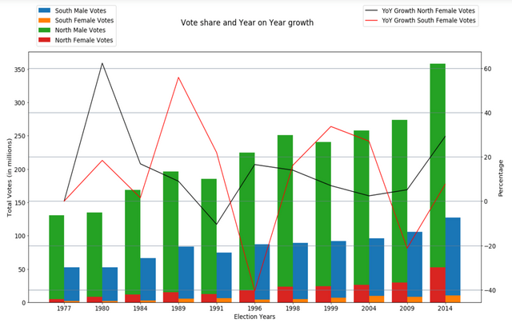

* Please check the complete report: [click here](https://adityam582.github.io/files/CSSProjectReport.pdf)

# Research-driven Projects

## Digital Consumer Behavior

* **Title**: Influence of micro moments on the customer journey 

* **Abstract**: The overall aim of this paper is to explore the influence of Micro moments in customer’s journey. This paper helps to have a better understanding of customer’s journey and the usage of micro
moments for successful business. Two third of world population are using mobile devices, the usage of mobile had influenced human behavior in socializing, finding new data and buying products. In this paper the human behavior and strategies used in business are analyzed using the concepts of economics. The study done here shows micro moments are intent-rich moments which influence the decision making in a customer jouney. During this moments the expectation of users are high and those who satisfy their expectation will have successful business (Sridhar Rama swamy/april2015). The paper provides an insight of various studies done on user micro –
moments to specify the importance of micro moments in modern marketing. The case studies done during this research shows the tremendous success obtained after utilizing micro-moments. The studies suggest to use the various online tools to increase the online presence which gather the attention of consumers. Providing them the service without lake of time catalysis their interest towards company. The online reviews collected helps to gather higher number of customers. An attempt is taken to provide an overview of recent studies from various sources about the changes in online user experience

* Please check the complete report: [click here](https://adityam582.github.io/files/DigitalConsumerBehaviorSeminarReport.pdf)

## Research Lab

* **Title**: Early Mover Advantage on GitHub 

* **Abstract:** Collaborative consensus-finding is an integral element of many Web services and greatly determines the quality of information, content, and products that are available through the Web. That
also means that the dynamics of democratic consensus-finding strengthen collective resilience against potential threats that attempt to degrade information, content, and products and affect Web data, users, behaviors, and even beyond as well as offline life. Even on Web platforms that are open to all, the influence of some first mover authors may shape future discussion and collaboration, which is comparable to academic citation networks for instance. In a social coding network such as GitHub, activities of a set of users can have influence on other users who can get interested in further actions, possibly contributing to a new project together with influential users. In this paper, we analyze the effect of con-
tribution activities on gaining influence in this and comparable networks that provide users the functionality and aims for reaching collaborative goals on the Web. For this purpose, we present an
empirical approach to identify the top influential users by using network features and contribution characteristics, which we find in existing and newly collected data set. We find that early adopter
dynamics exist in the GitHub community, where early adopters have more followers in the end as expected. However, we also see counterexamples that arise due to the social networking behavior of late adopters, and due to the aging effect of older repositories and users. We publicly share the source code and the data sets for reproducing our paper.

* Please check the complete report: [click here](https://adityam582.github.io/files/ResearchReportFirstMoverAdvantageGitHub.pdf)

## Big Data

* **Title**: Edge Computing

* **Abstract**: With the advancement in network availability, continuous adoption of internet and cloud computing technologies, the number of internet users have increased phenomenally. With this proliferation of the number of devices connected to the internet, there is an unprecedented need for data processing and
storage. Traditionally, the data has been sent from the source to the data centres for processing through the internet. However, with billions of devices on the internet, data generation speed has been comparatively higher than data transmission speed. Cloud computing often involves latency due to back and forth
data transmission, therefore it is proving to be inadequate for time-sensitive applications. Edge computing paradigm suggests that rather than transmitting data through the constrained networks, the computation can be moved near the source of data, which can solve issues of latency, bandwidth, privacy and security as well. The objective of this paper is to provide an overview of edge computing, technological implementations, advantages, use cases, challenges and further research problems.

* Please check the complete report: [click here](https://adityam582.github.io/files/BigDataSeminarReportEdge_Computing.pdf)

## ICT and Behavior Change

* **Title**: Towards a healthy use of Facebook in everyday life

* **Abstract**: There has been extensive research about the negative effects of problematic Facebook use
on the subjective well-being of people. Recently, several studies focused on measuring the positive effects
on well-being by Information and Communication Technologies (ICT) enabled intervention to reduce
everyday Facebook usage. This study conducts a literature review to explore the positive and negative
aspects of Facebook use for different usage styles. Also, it extends to identify empirical evidence from
existing studies about intervention models to reduce Facebook use, which can potentially benefit the
subjective well-being of users.

* Please check the complete report: [click here](https://adityam582.github.io/files/ICT_Seminar_Paper.pdf)

## Master Thesis 

* **Title**: Graph Representation Learning for Software Engineering

* Work-in-progress, coming soon here
